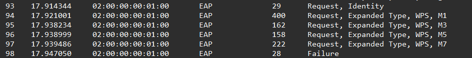

## Scénario
>Merci d'avoir répondu à notre appel. Le ministère de la Défense de Velorian a désespérément besoin d'aide...
>
>Nous devons rester discrets, mais nous pensons que le Wi-Fi public des bureaux du ministère de la Défense de Velorian a été compromis. L'impact semble faible, mais les diagrammes du réseau montrent qu'aucune segmentation réelle du réseau n'a été réalisée et que le trafic entre les appareils est autorisé. Les ministres du gouvernement utilisent ce réseau avec des équipements BYoD et des hôtes Velorian MoDNet. Veuillez analyser le pcap fourni et confirmer comment et quand cela s'est produit. N'oubliez pas que cette enquête est de type TLP Amber.

## Fichiers
- opshieldwall1.zip contenant la capture réseau "VELORIA-NETWORK.pcap" 


## Setup
Au vu de la simplicité de ce challenge, on peut simplement se limiter à tshark / wireshark.


## Questions

### Question 1
#### Veuillez confirmer le SSID de notre réseau WiFi.

Premièrement, familiarisez-nous avec la capture. Nous allons utiliser la commande suivante afin d'avoir des statistiques : 
```shell
$ tshark -r traffic.pcapng -qz
```
- `-r` permet de lire (read) un fichier
- `-q` permet d'être plus "quiet" à la sortie (utile pour les stats car cela permet d'afficher les statistiques globales, et non par paquet.)
- `-z` permet l'affichage de statistiques

Il y a beaucoup de valeurs possible (`tshark -z help` pour les afficher) mais ici nous souhaitons avant tout savoir : 
- le nombre de paquet 
- la durée de la capture
- les IPv4 avec le plus de paquet
- les IPv4 endpoints échangeant ensemble le plus
- les protocoles les plus utilisés 

**Nombre de paquet et durée :** 106 ; 31.6 sec
```shell
$ tshark -r VELORIA-NETWORK.pcap -qz io,stat,0

===================================
| IO Statistics                   |
|                                 |
| Duration: 31.6 secs             |
| Interval: 31.6 secs             |
|                                 |
| Col 1: Frames and bytes         |
|---------------------------------|
|              |1               | |
| Interval     | Frames | Bytes | |
|-------------------------------| |
|  0.0 <> 31.6 |    106 | 20759 | |
===================================
```

**IPv4 endpoints :**
- avec le plus de paquet : 
```shell
$ tshark -r VELORIA-NETWORK.pcap -qz endpoints,ip       
================================================================================
IPv4 Endpoints
Filter:<No Filter>
                       |  Packets  | |  Bytes  | | Tx Packets | | Tx Bytes | | Rx Packets | | Rx Bytes |
0.0.0.0                        3          1044          3            1044           0               0   
255.255.255.255                3          1044          0               0           3            1044   
10.0.3.1                       3          1048          3            1048           0               0   
10.0.3.52                      3          1048          0               0           3            1048   
================================================================================
```

- échangeant le plus : 
```shell
tshark -r VELORIA-NETWORK.pcap -qz conv,ip              
================================================================================
IPv4 Conversations
Filter:<No Filter>
                                               |       <-      | |       ->      | |     Total     |    Relative    |   Duration   |
                                               | Frames  Bytes | | Frames  Bytes | | Frames  Bytes |      Start     |              |
0.0.0.0              <-> 255.255.255.255            0 0 bytes         3 1044 bytes       3 1044 bytes    23.256576000         8.3680
10.0.3.1             <-> 10.0.3.52                  0 0 bytes         3 1048 bytes       3 1048 bytes    23.256959000         8.3693
================================================================================
```

**Protocoles les plus utilisés :**
```bash
tshark -r VELORIA-NETWORK.pcap -qz io,phs        

===================================================================
Protocol Hierarchy Statistics
Filter: 

sll                                      frames:106 bytes:20759
  radiotap                               frames:92 bytes:17572
    wlan_radio                           frames:92 bytes:17572
      wlan                               frames:92 bytes:17572
        wlan.mgt                         frames:92 bytes:17572
  eapol                                  frames:6 bytes:999
    eap                                  frames:6 bytes:999
  ip                                     frames:6 bytes:2092
    udp                                  frames:6 bytes:2092
      dhcp                               frames:6 bytes:2092
  arp                                    frames:2 bytes:96
===================================================================

```

Pour répondre à la question, il suffit d'utiliser la commande : 
```shell
$ tshark -r VELORIA-NETWORK.pcap  -T fields -e wlan.ssid | head -n 1 | xxd -r -p

VELORIA-MoD-AP012
```

**Explication** :
(https://www.wireshark.org/docs/dfref/w/wlan.html)
- `-t` affiche uniquement les champs spécifiés par l'utilisateur (nécessite donc forcément l'utilisation de l'option -e pour spécifier les champs).
- `-e wlan.ssid` spécifie que le champ wlan.ssid (SSID des réseaux sans fil) doit être extrait et affiché.
- `-xxd -r -p` l'output étant une suite hexadécimale, cela permet de le convertir en texte lisible

**Réponse** : 
``VELORIA-MoD-AP012``	

### Question 2
#### Veuillez confirmer l'adresse MAC du point d'accès (AP).

```shell
tshark -r VELORIA-NETWORK.pcap  -T fields -e wlan.sa | head -n 1
02:00:00:00:01:00
```

**Réponse** : 
``02:00:00:00:01:00``	

### Question 3
#### Veuillez confirmer l'état/le mécanisme d'authentification de l'AP et le vecteur d'attaque.
Passons à Wireshark.



**Réponse** : 
``WPS``	

### Question 4
#### Quel est le numéro de paquet où l'attaque a-t-elle commencé ?

On peut facilement en déduire que c'est à la première tentative de connexion (étant les seuls dans la capture).

**Réponse** : 
``93``	


### Question 5
#### Quel est le numéro de paquet où l'attaque s'est-elle terminée ?

On peut facilement en déduire que c'est lorsque l'authentifcation a échoué.

**Réponse** : 
``8``	
