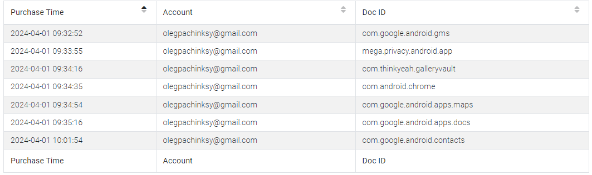
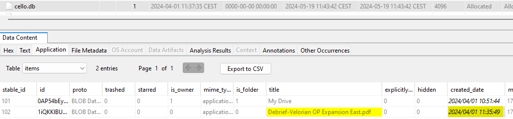

## Scenario
> We have successfully confirmed the location of the malicious actor who compromised our government’s WiFi network.
> 
> Recently, a dawn raid was conducted as part of OP ERADICATE at an address in the Velorian capital, resulting in the seizure of a substantial amount of evidence. Notably, an Android device belonging to the agent was confiscated, and it is believed to have been at the scene of the attack.
> 
> We require your expertise to analyze this device and answer the detailed questions below. Time is limited; a Velorian COBR meeting has been organized to discuss your findings...

## Files
- `opshieldwall2.zip` containing "EVIDENCE-CASE-RAVENSKIAN-AGENT-002," which includes the "data" and "storage" folders of an Android device.

This provides a significant amount of room for analysis, as the /data directory contains a wealth of information, such as:

    


## Foreword
Before we begin, here is some important information about Android:

User data on Android can be stored both internally and externally. Internal data is saved in NAND flash memory, a non-volatile memory that retains data even when the power is off. NAND stores the bootloader, the operating system, and user data. Application data is stored on NAND flash memory or on the SD card.

Android is based on variants of the Long-Term Support (LTS) branches of the Linux Kernel. With Android v8 (Oreo), Google required the use of Linux Kernel version 4.4 or higher. For example, Android v9 (Pie) runs on versions 4.4, 4.9, or 4.14, depending on the device. More information is available on the Android OS wiki: [https://source.android.com/docs/core/architecture/kernel/android-common?hl=en](https://source.android.com/docs/core/architecture/kernel/android-common?hl=en).

`android-mainline` is the primary development branch for Android features. The mainline Linux branch is merged with `android-mainline` every time Linus Torvalds releases a version or release candidate:

Commonly found file systems include:
- EXT4
- F2FS
- YAFFS2
- exFAT

Most artifacts are stored as SQLite databases and XML files. Android isolates applications at the kernel level, assigning each one a unique identifier (UID) to track running applications.

### Android Architecture

- The Linux kernel forms the foundation of Android, supporting essential features like threads and low-level memory management used by Android Runtime (ART).

- The Hardware Abstraction Layer (HAL) provides standardized interfaces that expose hardware functionality to higher-level Java APIs. It consists of library modules specific to each hardware component (such as the camera or Bluetooth). When an API accesses hardware, Android loads the corresponding library module.

- The Android Runtime (ART) environment runs each application in its own process and instance. ART manages multiple virtual machines on low-memory devices, using DEX bytecode specially designed and optimized for Android. Compilation tools like d8 transform Java code into DEX bytecode for execution on Android.

- Many essential Android system components and services, such as ART and HAL, are created from native code requiring native libraries written in C and C++.

- Android's features are accessible via Java APIs, facilitating the reuse of key modular system components and services like notifications, resource management, and localization.

- System applications are the core set of apps that come with Android.

### Android Virtual Machine

- Virtual Machines (VMs) act as abstraction layers between an application and the underlying Android device.

- Each application runs in its own instance within a VM, isolating it from other applications.

- Android applications are written in Java but are compiled into Java bytecode.

- This bytecode is then transformed into Dalvik bytecode (.dex files) or ART bytecode.

- Dalvik and ART run the bytecode (.dex) in a virtual machine, allowing applications to function independently of the underlying hardware.

- Before KitKat (v.4.4), Android used Dalvik VMs.

- Starting with Lollipop (v5.0), Android began using Android Runtime (ART) and phased out Dalvik VM.

- Both Dalvik and ART use DEX bytecode, but ART includes new optimization features.

### Directory Structure

- **/cache**: Can contain Gmail attachments, downloads, browsing data, and OTA updates.
- **/efs**: Contains files necessary for device operation in case of failure.
- **/data**:
  - **/data/data**: Contains application folders (`/data/data/com.example.app`), app configuration files, SQLite databases, logs, cache, etc.
  - **/app**: Stores .apk files from the Android market. *Malware may be found here.
  - **/backup**: Stores backup APIs for developers; user backup data is not stored here.
  - **/media**: Internal storage equivalent to an SD card. *Malware may be found here.
  - **/misc**: Stores files related to Bluetooth, DHCP, VPN, Wi-Fi, etc.
  - **/system**: Contains key files such as `gesture.key` and `passwords.key`; the `accounts.db` file, which stores usernames and passwords for file authentication, etc.
  - **/property**: Stores system properties, including timezone, language settings, etc.
- **/mnt**:
  - **/asec**: Stores unencrypted app data.
  - **/DCIM**: Stores album thumbnails.
  - **/Pictures**: Stores camera images.
  - **/downloads**: Locally downloaded files.
  - **/secure/asec**: Stores encrypted app data.
- **/system**:
  - **/app**: Contains .apk files. *Malware may be found here.
  - **/priv-app**: Contains .apk files with system-level permissions. *Malware may be found here.

For more information on:
- App permissions: [https://developer.android.com/guide/topics/permissions/overview?hl=en](https://developer.android.com/guide/topics/permissions/overview?hl=en), [https://blog.mindorks.com/what-are-the-different-protection-levels-in-android-permission/](https://blog.mindorks.com/what-are-the-different-protection-levels-in-android-permission/)
- Android CLI: [https://developer.android.com/tools/adb?hl=en](https://developer.android.com/tools/adb?hl=en)

## Setup
Given the files and the scenario, I will use the Autopsy tool. Setting it up may take some time, so I’m starting with it here.

If you're unfamiliar with Autopsy, here’s a brief description:
> Autopsy is an open-source digital investigation tool. It serves as the graphical interface for the Sleuth Kit and other forensic tools. It is commonly used to analyze hard drives and smartphones in the context of investigations. Key features of Autopsy include deleted file recovery, metadata analysis, keyword searching, timeline visualization, file system analysis, and more.

To use it, we need to create a "Case":

<!-- 

    


 -->

Here, we know we’re not dealing with a "Disk Image" or a VM, nor a local disk. Therefore, we select the appropriate option, "Logical Files": 

<!-- 

    


 -->

We wait for Autopsy and its modules to complete the ingestion process. This may take some time.

All set, we can begin the investigation:

<!-- 

    


 -->

## Questions

### Question 1
#### What is the email address used by the agent in various applications/services?
To answer this, I will use the report generated by Autopsy via ALEAPP (Android Logs Events And Protobuf Parser), an open-source project aimed at parsing all known Android artifacts for forensic analysis.

To find it quickly and easily, we can search in: 
- ``/data/data/com.android.vending/databases/library.db`` to find the Google account used to download apps.

- ``/data/data/com.android.providers.contacts/databases/contacts2.db`` to find the Google account used to sync contacts.

Additionally (not applicable in this challenge):
- ``/data/com.android.vending/shared_prefs/lastaccount.xml`` (last account used on Google PlayStore for Android 9 and later).
- ``/data/com.google.android.gms/shared_prefs/BackupAccount.xml`` (email for backup account).
- ``/data/com.android.email/databases/EmailProvider.db`` (email accounts, 3rd-party app data, and messages associated with email notifications).

Finally, we end up with the HTML report:

<!-- 

    


 -->

The email address can be found in various places.

For example, in the "Chrome" app under "Autofill" (a feature that automatically fills in forms with saved information):

In the Chrome "Login Data":

And in the "Installed Apps (Library)" section, we find the Google account email used for app downloads:

**Answer**:
``olegpachinksy@gmail.com``

### Question 2
#### What is the contact number of the handler assigned to the arrested agent?

In the "Contacts" section:

**Answer**:
``+323145232315``

### Question 3
#### Retrieve the credentials and link to the official portal for Ravenski agents. This could provide an intelligence advantage by using this access to gather actionable information about upcoming operations planned by the Ravenski government.

We already found the answer to this question in Question 1 via Chrome "Login Data":

**Answer**:
``agent.ravensk.idu.com:olegpachinksy007:HBLKNKD0MADsdfsa2334(*&DSMDB``

### Question 4
#### What is the contact code used to confirm the identity of the agent and handler when using a secure chat channel?

First, I’ll check for potential SMS messages here: ``/data/data/com.android.providers.telephony/databases/mmssms.db``.

Nothing found.

We could also check here, though not applicable in this challenge:
- ``/data/com.google.android.gms/databases/icing_mmssms.db`` (SMS/MMS).
- ``/data/com.google.android.gms/databases/ipa_mmssms.db`` (SMS/MMS).

We need to find the messaging app used. In Autopsy’s "Installed Programs" section, we can view all installed apps:

Different categories are shown:
- Installed Apps (GMS)
- Installed Apps (Library)
- Installed Apps (Vending)

**Installed Apps - GMS**:
This category refers to apps installed on the device, regardless of their installation method. Data can be found here: `/data/com.google.android.gms/databases/`.

**Installed Apps - Library**:
This category refers to the app library for the Google user on the device. It may contain apps installed by the same Google account on another device or a previous installation. Data is stored here: `/data/com.android.vending/databases/`.

**Installed Apps - Vending**:
This category specifically refers to apps installed via the Google Play Store. Data is retained even if the app is uninstalled and is located here: `/data/com.android.vending/databases/`.

For clarity, let’s return to ALEAPP and focus on "Vending" type apps:

The app that stands out is ``mega.privacy.android.app``. Indeed, it’s a messaging application:

ALEAPP has parsed messages exchanged via MEGA:

We can find this information here: ``/data/data/mega.privacy.android.app/karere-TU1IaTh4TUJpdTQKAfO_2P0qU8NMP7zDRlgv.db``.

**Answer**:
``REDAPPLEONACAR``

### Question 5
#### The handler shared a document with the agent using a cloud storage service. When was this file shared with the agent?

Nothing found in messages. The document must have been sent another way. We know there’s no other messaging app, and it couldn’t have been sent via SMS/MMS.

In the installed apps, we saw ``com.google.android.apps.docs``. Let’s check here: ``\data\data\com.google.android.apps.docs``.

We find the database ``/data/data/com.google.android.apps.docs/app_cello/olegpachinksy@gmail.com/cello.db`` containing this information:

The file can also be found here: ``EVIDENCE-CASE-RAVENSKIAN-AGENT-002/storage/emulated/0/Download/Debrief-Velorian OP Expansion East.pdf``:

Note: Autopsy interprets timestamps using your computer’s time zone by default. Remember to adjust this setting in Autopsy (Tools > Options > View > Time Zone).

**Answer**:
``2024-04-01 09:36:41``

### Question 6
#### What is the download URI for the previously identified shared file?

We know the file was downloaded, as we found it in ``/storage/emulated/0/Download/``.

Thus, we can search in ``/data/data/com.android.providers.downloads/databases/downloads.db``:

**Answer**:
``https://www.googleapis.com/drive/v2internal/files/1iQKKlBU2vuJD1Xet6IYPt7IODVtDHxv1?alt=media&source=downloadUrl&auditContext=fileAction&reason=909&syncType=1&featureLabel=android-sync-classic&openDrive=false&errorRecovery=false&originatorApp=102``

### Question 7
#### To gather further intelligence for Veloria’s counter-espionage efforts, what was the primary objective of this cyber operation led by the Ravenski government?

Returning to the document:

**Answer**:
``Infiltrate the Velorian secured network to gather intelligence on upcoming cyber-attacks, their techniques, and target countries.``

### Question 8
#### Identifying the handler is also crucial for Velorian law enforcement to understand the scope of this operation. What is the handler’s email address?

We already saw this in the MEGA app messages:

**Answer**:
 ``ivoryalex783@gmail.com``

### Question 9
#### What is the name of the place where the agent and handler met?

Returning to the messages:

This question took the most time; I spent about an hour on it.

Initially, I searched the usual locations:
- ``/data/com.google.android.apps.maps/databases/gmm_storage.db``
- ``/data/com.google.android.apps.maps/databases/search_history.db``
- ``/data/com.google.android.apps.maps/databases/da_destination_history``
- ``/data/com.sec.android.daemonapp/db/weatherClock``
- ``/data/com.google.android.apps.maps/app_tts-cache/``
- ``/data/com.google.android.apps.maps/cache/image_manager_disk_cache/``

After finding nothing, I thought the answer might be in the metadata of images on the phone. Indeed, there were 48 images, several of which showed bars:

However, nothing conclusive.

I then questioned:
- Are there other navigation/location apps on the phone?
- Is it certain I should look in the Google Maps app?

1. No, only Google Maps.
2. No, it’s possible the search was made in the browser instead.

After checking typical Google Maps artifacts, I decided to search in the browser but found nothing.

So I returned to digging through Google Maps artifacts:

- app: nothing relevant
- app_offline_downloads: nothing relevant
- app_offline_hashes: nothing relevant
- app_textures: nothing relevant
- app_webview: nothing relevant
- cache: nothing relevant
- databases: too many files, will revisit
- files: "new_recent_history_cache_search.cs"

It turns out I could have simply searched for the keyword "Pub" 🤡

**Answer**:
``Levstik Pub``

### Question 10
#### According to the chat between the agent and handler, it appears that the handler sent the agent an image related to the infrastructure used by the Ravenski government for this cyber-espionage operation. What C2 framework is used by the Ravenski government?

Having already reviewed all images for Question 9, I have the answer.

**Answer**:
``Empire``

### Question 11
#### Collecting information on infrastructure, such as IP addresses or hostnames, is crucial for Velorian authorities as they prepare a counter-offensive. Based on the recovered image sent by the handler to the agent, what is the IP address of one of the C2 servers operated by Ravenski threat actors?

**Answer**:
``98.24.12.45``

