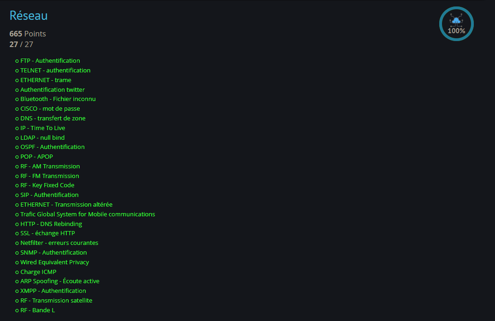
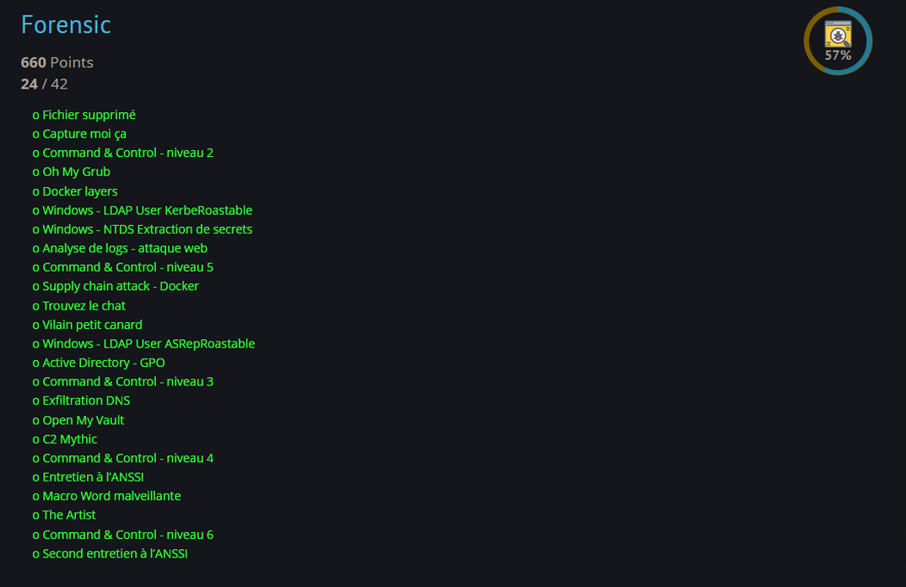

Liste de tous les challenges, labs, box etc. que j'ai effectué mais aussi des conférences et trainings auquels j'ai assisté.

## HackTheBox 

- Green = Easy
- Orange = Medium
- Red = Hard

Certaines images ne redirigent pas vers les pages de résultat d'HTB car se sont des boxs / sherlocks uniquement disponibles sur la plateforme HackTheBox Entreprise (qui ne permet pas de faire des liens de partage).

### Sherlock 

#### DFIR / SOC 

    


    


    


    


    


    


    


    


    


#### Malware Analysis

    


#### Cloud 

    


### Box

    


    


    


    


    


    


    


    


    


    


    


    


    


    


## HackTheBox Academy
### Modules
[Transcript.pdf](htb-academy-transcript.pdf)

 

## RootMe
### Réseaux (100% à la date du 10/05/2024)

 

### Forensic (57% à la date du 10/05/2024))

 

## Cyberdefenders
### Network Forensics 

    


    


    


    


    


    


    


    


## TryHackMe
### Path

    


    


    


## Conf & meetups
### 2023

    


    


    


    


