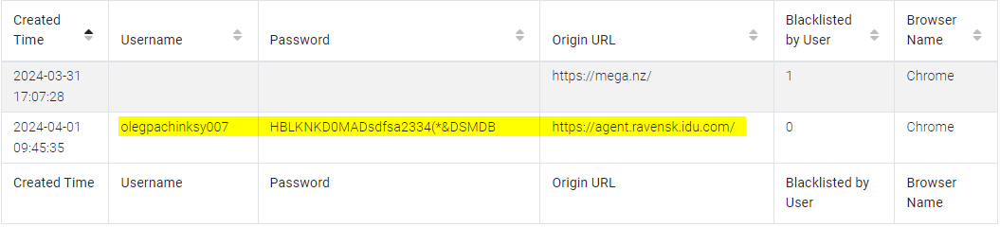
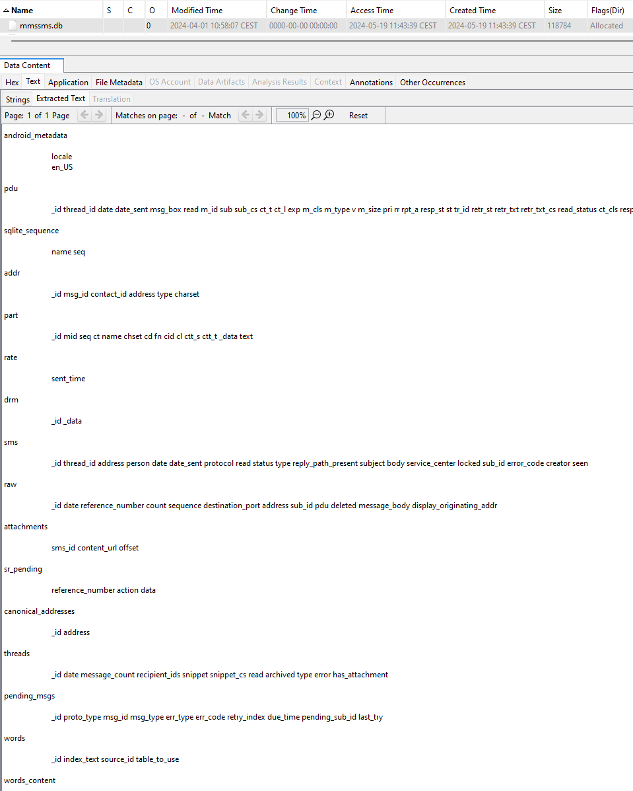
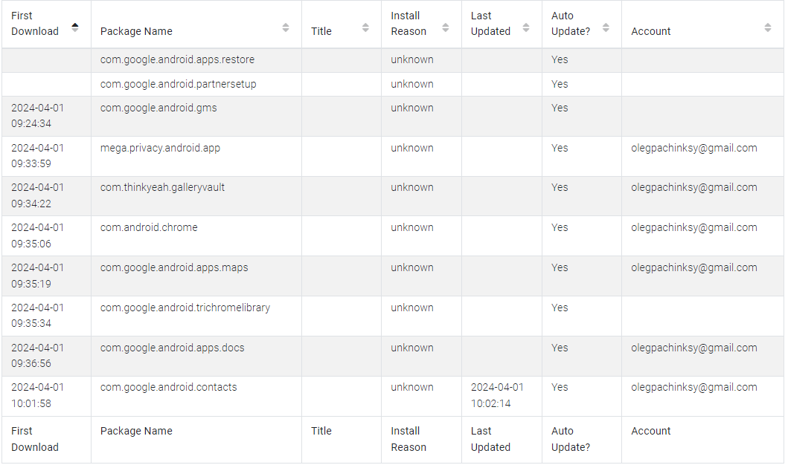
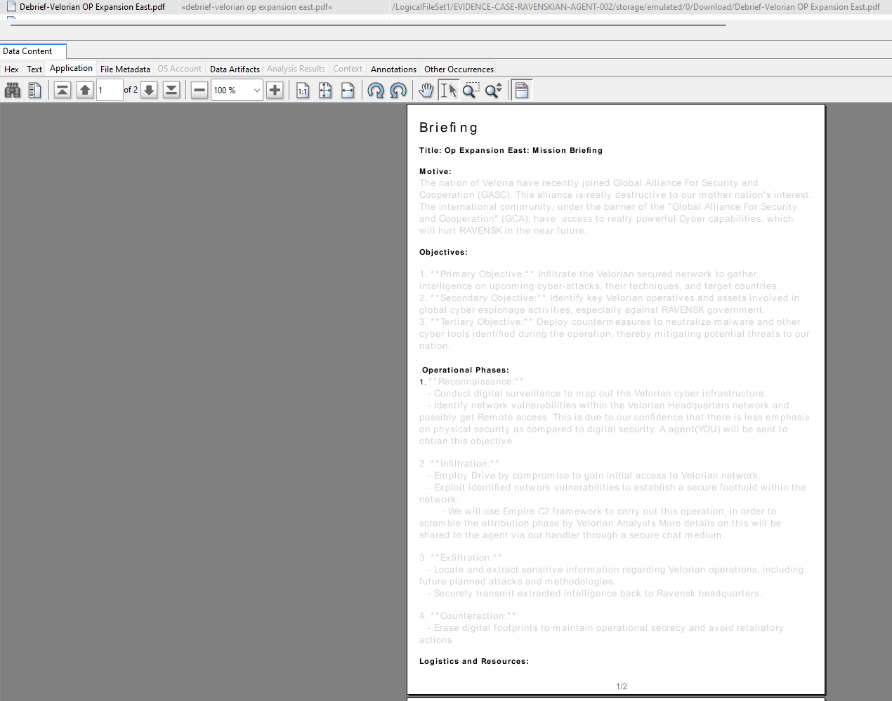
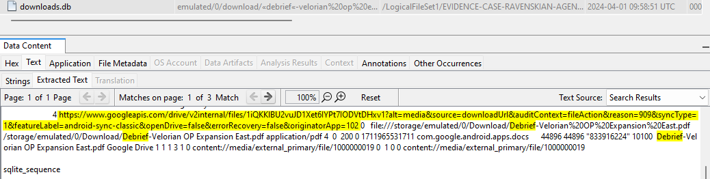
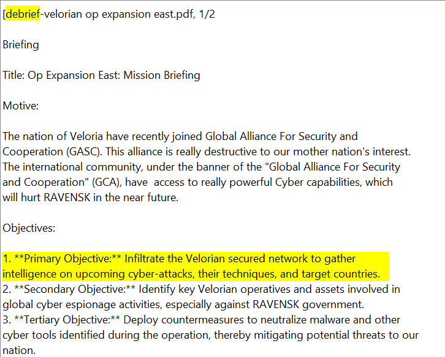
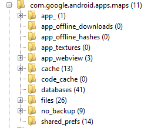
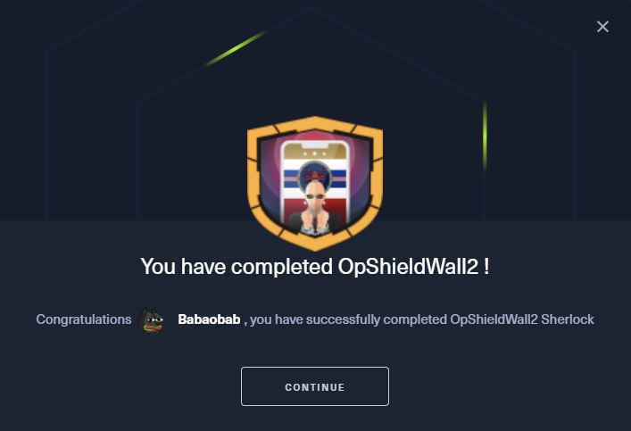

## Scénario
> Nous avons réussi à confirmer la localisation de l'acteur malveillant qui a compromis le réseau WiFi de notre gouvernement.
> 
> Récemment, un raid à l'aube dans le cadre de l'OP ERADICATE a été mené à une adresse dans la capitale vélorienne et une quantité considérable d'éléments de preuve a été saisie. On notera en particulier un appareil Android appartenant à l'agent, dont on pense qu'il se trouvait sur le lieu de l'attaque.
> 
> Nous avons besoin de votre expertise pour analyser cet appareil et répondre aux questions détaillées ci-dessous. Vous n'avez pas beaucoup de temps, une réunion du COBR vélorien a été organisée pour discuter de vos résultats...

## Fichiers
- opshieldwall2.zip contenant "EVIDENCE-CASE-RAVENSKIAN-AGENT-002" où on le retrouve le dossier "data" et "storage" d'un Android

Cela nous laisse pas mal de marge de manœuvre, en effet, le /data contient énormément d'informations telles que :

    


## Setup
Au vu des fichiers et du scénario, je vais utiliser l'outil Autopsy. Cela peut prendre un peu de temps à ce setup, c'est pour cela que j'attaque cela ici. 

Si vous ne connaissez pas Autopsy, voici une briève description :
> Autopsy est un outil d'investigation numérique opensource. Il se rapporte à l'interface graphique du Sleuth Kit et d'autres outils de forensic. Il est utilisé pour analyser des disques durs et des smartphones dans le cadre d'enquêtes. Les fonctionnalités clés d'Autopsy incluent la récupération de fichiers supprimés, l'analyse des métadonnées, la recherche par mots-clés, la visualisation des timelines d'activités, et l'analyse des systèmes de fichiers etc.

Pour l'utiliser, nous devons créer une "Case" :

    


Ici, nous savons que nous n'avons pas à faire à une "Disk Image" ou à une VM, de même pour un disque local. Nous choisissons donc l'option appropriée "Logical Files" : 

    


On attend qu'Autopsy & ses modules terminent l'ingestion. Cela peut prendre un moment.

C'est bon, on peut commencer l'investigation :

    


## Questions

### Question 1
#### Quelle est l'adresse mail de l'agent qui a été utilisée dans diverses applications/services ?
Pour y répondre, je vais utiliser le rapport qu'Autopsy a généré via ALEAPP (Android Logs Events And Protobuf Parser), un projet open-source qui vise à analyser tous les artefacts Android connus à des fins d'analyse forensic. 

Pour trouver rapidement et simplement nous pouvons chercher dans : 
-  ``/data/data/com.android.vending/databases/library.db`` pour y trouver le compte google utilisé pour download des apps

-  ``/data/data/com.android.providers.contacts/databases/contacts2.db`` pour y trouver le compte google utilisé pour synchroniser ses contacts

Mais aussi (mais non applicable sur ce challenge) ici : 
- ``/data/com.android.vending/shared_prefs/lastaccount.xml`` (dernier compte utilisé sur Google PlayStore (Android 9 et plus))
- ``/data/com.google.android.gms/shared_prefs/BackupAccount.xml`` (email du compte de backup)
- ``/data/com.android.email/databases/EmailProvider.db`` (email accounts, 3rd party app data et les messages associés aux notifications par emails)

Enfin bref, on se retrouve donc avec le rapport en format html : 

    


On peut retrouver son adresse mail un peu partout. 

Dans l'app "Chrome" par exemple avec la partie "Autofill" (fonctionnalité qui permet de remplir automatiquement des formulaires avec des informations préenregistrées) : 

Dans les "Login Data" de Chrome :

Enfin dans la partie "Installed Apps (Library)" nous retrouvons l'adresse mail du compte google utilisé pour download des apps : 

**Réponse** : 
``olegpachinksy@gmail.com``	

### Question 2
#### Quel est le numéro de contact du gestionnaire (handler) affecté à l'agent qui a été arrêté ?

Dans la partie "Contacts" :

**Réponse** : 
``+323145232315``

### Question 3
#### Récupérer les identifiants et le lien du portail officiel des agents ravenskiens. Cela peut nous donner un avantage en matière de renseignement car nous pouvons utiliser cet accès pour obtenir d'autres informations exploitables sur les opérations que le gouvernement ravenskien planifie.

Nous avons déjà trouvé la réponse à cette question à la question n°1 via les "Login Data" de Chrome : 

**Réponse** : 
``agent.ravensk.idu.com:olegpachinksy007:HBLKNKD0MADsdfsa2334(*&DSMDB``

### Question 4
#### Quel est le code de contact utilisé pour confirmer l'identité de l'agent et du gestionnaire lors de l'utilisation d'un canal de discussion sécurisé ?

Premièrement je vais vérifier les potentiels SMS ici : ``/data/data/com.android.providers.telephony/databases/mmssms.db``.

Nous n'y trouvons rien.

Nous pourrions aussi chercher ici mais non applicable sur ce challenge : 
- ``/data/com.google.android.gms/databases/icing_mmssms.db`` (SMS/MMS)
- ``/data/com.google.android.gms/databases/ipa_mmssms.db`` (SMS/MMS)

Nous devons donc trouver l'app de messagerie utilisé. On peut voir toutes les apps installées dans la partie "Installed Programs" d'Autopsy : 

On y trouve différente catégorie : 
- Installed Apps (GMS)
- Installed Apps (Library)
- Installed Apps (Vending)

**Installed Apps - GMS** : 
Cette catégorie concerne les applications installées sur l'appareil, quel que soit leur mode d'installation. On peut retrouver ces données ici : `/data/com.google.android.gms/databases/`.

**Installed Apps - Library** : 
Cette catégorie se réfère à la bibliothèque d'applications pour l'utilisateur Google utilisant l'appareil. Il est important de noter que cette DB n'est pas liée aux applications installées sur l'appareil, elle peut contenir des applications installées par le même compte Google sur un autre appareil ou sur une précédente installation de l'appareil analysé. On peut retrouver ces données ici : `/data/com.android.vending/databases/`.

**Installed Apps - Vending** : 
Cette catégorie concerne spécifiquement les applications installées sur l'appareil via le Google Play Store, excluant celles installées par d'autres moyens. Ces données ne sont pas supprimées lorsque l'application est désinstallée. Elles sont stockées dans une DB SQLite située ici : `/data/com.android.vending/databases/`.

Pour plus de lisibilité retournons sur ALEAPP et concentrons-nous sur les apps de type "Vending" :

L'app qui saute au yeux c'est ``mega.privacy.android.app``. Et en effet, c'est une application de messagerie :

Justement ALEAPP a parsé les messages échangés via MEGA :

On peut retrouver ces infomations ici : ``/data/data/mega.privacy.android.app/karere-TU1IaTh4TUJpdTQKAfO_2P0qU8NMP7zDRlgv.db``.

**Réponse** : 
``REDAPPLEONACAR``

### Question 5
#### Le gestionnaire a partagé un document avec l'agent en utilisant un service de stockage cloud. Quand ce fichier a-t-il été partagé avec l'agent ?

Rien dans les messages. Le document a donc dû être transmis d'une autre manière. Nous savons qu'il n'y a pas d'autre app de messagerie et qu'il n'a pas pu lui communiquer via SMS/MMS. 

Dans les app installé nous avons vu ``com.google.android.apps.docs``. Allons donc chercher ici : ``\data\data\com.google.android.apps.docs``. 

On y trouve la DB ``/data/data/com.google.android.apps.docs/app_cello/olegpachinksy@gmail.com/cello.db`` contenant ces informations : 

On peut d'ailleurs retrouver ce fichier ici : ``EVIDENCE-CASE-RAVENSKIAN-AGENT-002/storage/emulated/0/Download/Debrief-Velorian OP Expansion East.pdf`` :

Néanmoins attention, par défaut Autopsy interprète les timestamps avec la time zone de votre ordinateur. Pensez bien à modifier ce paramètre dans Autopsy (Tools > Options > View > Time Zone). 

**Réponse** : 
``2024-04-01 09:36:41``

### Question 6
#### Quel est l'URI de téléchargement du fichier partagé précédemment identifié ?

Nous savons que le fichier a été téléchargé car nous l'avons retrouvé dans ``/storage/emulated/0/Download/``.

Nous pouvons donc chercher dans ``/data/data/com.android.providers.downloads/databases/downloads.db`` :

**Réponse** : 
``https://www.googleapis.com/drive/v2internal/files/1iQKKlBU2vuJD1Xet6IYPt7IODVtDHxv1?alt=media&source=downloadUrl&auditContext=fileAction&reason=909&syncType=1&featureLabel=android-sync-classic&openDrive=false&errorRecovery=false&originatorApp=102``

### Question 7
#### Afin d'obtenir davantage d'informations pour le contre-espionnage de Veloria, quel était l'objectif principal de cette cyber-opération menée par le gouvernement de Ravensk ?

Revenons au document : 

**Réponse** : 
``Infiltrate the Velorian secured network to gather intelligence on upcoming cyber-attacks, their techniques, and target countries.``

### Question 8
#### L'identification du gestionnaire est également cruciale pour que les forces de l'ordre véloriennes puissent comprendre l'étendue de cette opération. Quelle est l'adresse électronique utilisée par le manipulateur ?

Nous l'avons déjà vu dans les messages de l'app MEGA : 

**Réponse** : 
 ``ivoryalex783@gmail.com``

### Question 9
#### Quel est le nom de l'endroit où l'agent et le gestionnaire se sont rencontrés ?

Revenons aux messages : 

C'est la question qui m'a pris le plus de temps, j'ai dû bloquer une bonne heure dessus.

Premièrement, j'ai cherché dans les endroits habituels : 
- ``/data/com.google.android.apps.maps/databases/gmm_storage.db``
- ``/data/com.google.android.apps.maps/databases/search_history.db``
- ``/data/com.google.android.apps.maps/databases/da_destination_history``
- ``/data/com.sec.android.daemonapp/db/weatherClock``
- ``/data/com.google.android.apps.maps/app_tts-cache/``
- ``/data/com.google.android.apps.maps/cache/image_manager_disk_cache/``

Après n'avoir rien trouvé, je me suis dit qu'il était sans doute possible que la réponse soit dans les metadatas des images sur le téléphone. En effet, on retrouve 48 images dont plusieurs de bar :

Néanmoins, rien de probant. 

Je me suis donc posé plusieurs questions : 
- il y a-t-il d'autres applications de navigation / localisation sur le téléphone ?
- est-il sûr que je dois chercher dans l'app Google Maps ?

1. Non, seulement Google Maps.
2. Non, il est peut-être possible qu'il ait fait la recherche sur son navigateur et non sur l'app etc.

Ayant déjà vérifié les points habituels des artefacts de google maps j'ai préféré chercher dans le navigateur mais je n'ai rien trouvé. 

Je suis donc retourné fouiller dans les artefacts de google maps :

- app : RAS
- app_offline_downloads : RAS
- app_offline_hashes : RAS
- app_textures : RAS
- app_webview : RAS
- cache : RAS
- databases : trop de fichiers, j'y reviendrai plus tard 
- files : "new_recent_history_cache_search.cs"

Je me rends compte que j'aurais simplement pu chercher par mot-clé "Pub" 🤡

**Réponse** : 
``Levstik Pub``

### Question 10
#### D'après le chat retrouvé entre l'agent et le gestionnaire, il semble que ce dernier ait envoyé à l'agent arrêté une image relative à l'infrastructure utilisée par le gouvernement ravenskien pour cette opération de cyberespionnage. Quel est le cadre C2 utilisé par le gouvernement ravenskien ?

Ayant déjà vérifié toutes les images pour répondre à la question 9 j'ai déjà la réponse.

**Réponse** : 
``Empire``

### Question 11
#### La collecte d'informations sur l'infrastructure, telles que les adresses IP ou les noms d'hôtes, est cruciale pour les autorités véloriennes, qui préparent une opération de contre-offensive. D'après l'image récupérée envoyée par le gestionnaire à l'agent, quelle est l'adresse IP de l'un des serveurs C2 exploités par les acteurs de la menace ravenskiens ?

**Réponse** : 
``98.24.12.45``

